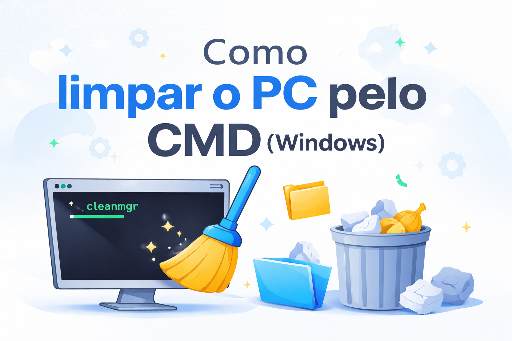
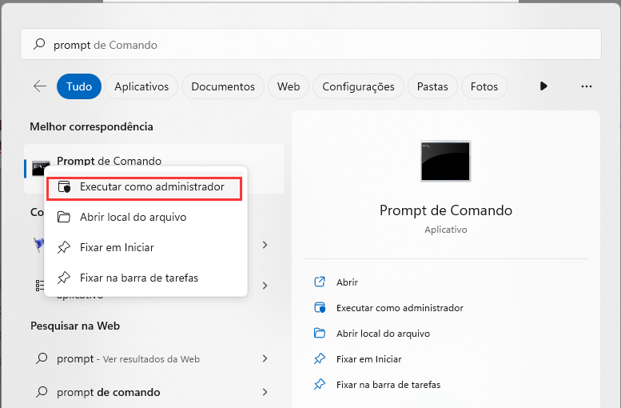
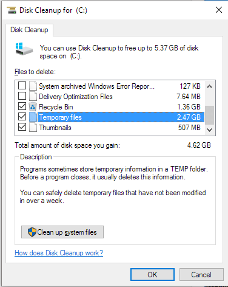
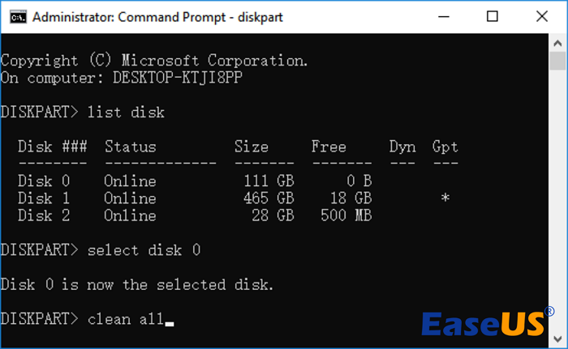

Este guia simples ajuda você a **limpar arquivos desnecessários** e melhorar o desempenho do seu PC, utilizando o **Prompt de Comando (CMD)** no Windows 10 ou 11.

A linguagem é clara e fácil de entender, ideal para quem está começando.

---

## 📌 O que você precisa

- **Windows 10 ou Windows 11**
- Acesso de **Administrador** para usar o CMD

---

## 🖥️ Como abrir o CMD como administrador

1. Abra o **Menu Iniciar**
2. Digite **cmd** na busca
3. Clique com o botão direito em **Prompt de Comando**
4. Selecione **Executar como administrador**



---

## 🧽 Limpar arquivos desnecessários (Limpeza de Disco)

O comando `cleanmgr` é uma ferramenta do Windows que ajuda a liberar espaço, removendo arquivos temporários, cache, e itens da lixeira.

### ▶️ Como usar

1. Abra o **Prompt de Comando** e digite o seguinte comando:

```bash
cleanmgr
```

2. Selecione o disco que deseja limpar (normalmente `C:`)
3. Marque os arquivos que deseja excluir (como arquivos temporários, lixeira, etc.)
4. Clique em **OK** e confirme




---

## ⚠️ Limpar o disco inteiro (avançado)

> **Atenção:** Este processo apaga **todos os dados** do disco. Faça backup antes de proceder.

Caso você queira apagar completamente um disco (ex: antes de formatar o computador), o **DiskPart** permite realizar essa operação.

### ▶️ Comandos

1. Abra o **Prompt de Comando** como administrador
2. Digite os seguintes comandos, um de cada vez:

```bash
diskpart
list disk
select disk n
clean
```

- **Substitua `n`** pelo número do disco correto.  
- Use o comando `clean all` para uma limpeza mais profunda (mais lenta).



---

## ✅ Conclusão

Usar o **CMD** para realizar a limpeza do seu sistema é uma maneira rápida e eficaz de manter o **Windows** organizado e com bom desempenho.  
Para a maioria dos usuários, a ferramenta **cleanmgr** já resolve a maior parte das necessidades de limpeza.

---

📌 **Dica:** Execute a limpeza de disco regularmente para evitar a acumulação de arquivos desnecessários e melhorar a performance do sistema.

<div align="center">

[![1.1]][1]

</div>

<div align="center">
  


</div>

[1.1]: https://massgrave.dev/img/logo_github.png (GitHub)


[1]: https://github.com/jp-devl/Limpeza-Cmd-Win10-11


---

<p align="center">Obrigado ❤️</p>
